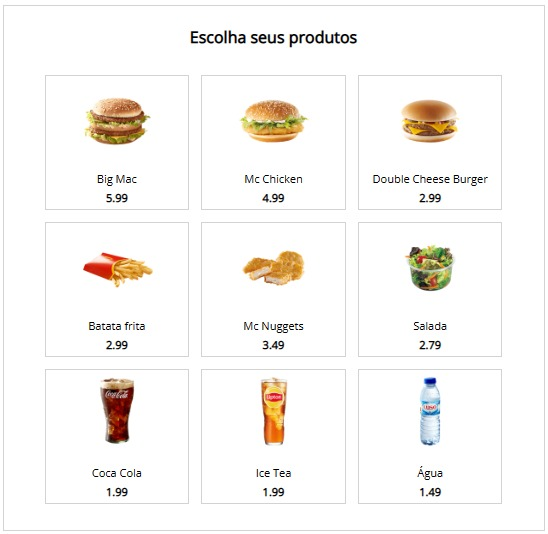

### Totem de atendimento

O projeto foi desenvolvido com Vue.js, utilizando JavaScript para comunicação. Isso permite que o usuário selecione um produto e veja na tela as informações de quantidade e valores correspondentes.
Devido a baixa complexidade do projeto, foi ultilizado o CDN do Vue.js descrito em sua documentação.

